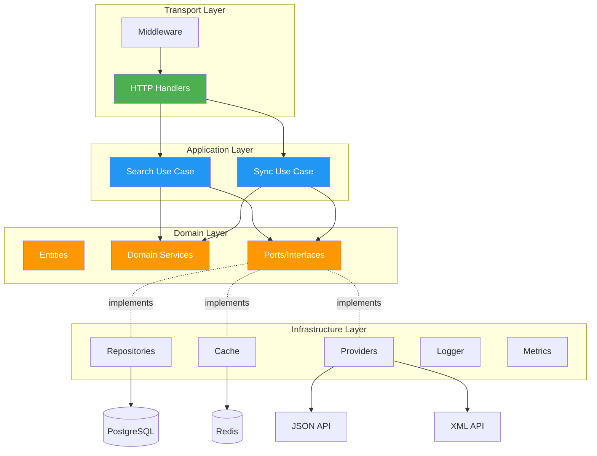
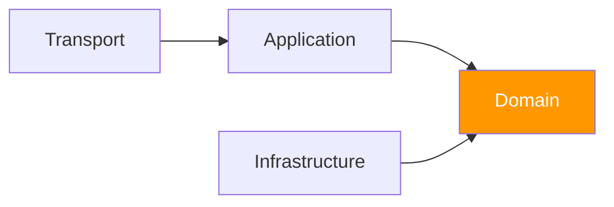

# 🏗️ Mimari Tasarım ve Prensipleri

Bu proje **Clean Architecture** (Hexagonal/Onion Architecture olarak da bilinir) prensiplerine göre tasarlanmıştır. Bu yaklaşım sayesinde sistem **test edilebilir**, **bakım yapılabilir** ve **genişletilebilir** olarak geliştirilmiştir.

## 🎯 Neden Clean Architecture?

### Geleneksel Monolitik Yaklaşım

```
[Controller] → [Business Logic + Database + External APIs]
```

**Sorunlar:**
- ❌ Business logic veritabanına sıkı sıkıya bağlı
- ❌ Test etmek için tam database setup gerekli
- ❌ Teknoloji değişimi çok maliyetli
- ❌ Kod tekrarı ve spagetti kod

### Clean Architecture Yaklaşımı

```
[Transport] → [Use Cases] → [Domain] ← [Infrastructure]
```

**Avantajlar:**
- ✅ Business logic izole ve bağımsız
- ✅ Mock implementation'larla kolay test
- ✅ Teknoloji değişimi sadece infrastructure layer'da
- ✅ SOLID prensiplere uygun, temiz kod

## 📐 Mimari Diyagram



## 🏛️ Katman Yapısı

### 1️⃣ Domain Layer (İş Kuralları Katmanı)

**En içteki katman** - Hiçbir dış bağımlılığı yoktur!

```
internal/domain/
├── entity/
│   └── content.go          # Tüm entity'ler (Content, Provider, Tag, Score, etc.)
├── service/
│   └── scoring_service.go  # Skorlama iş mantığı
├── port/
│   ├── content_repository.go  # Repository interface
│   ├── cache_repository.go    # Cache interface
│   └── provider_client.go     # Provider interface
└── errors/
    └── errors.go           # Domain-specific errors
```

#### Entities (Varlıklar)

İş mantığının temelini oluşturan veri yapıları. Tüm entity'ler `entity/content.go` dosyasında tanımlı:

```go
// entity/content.go

// ContentType içerik türünü temsil eder (video veya article)
type ContentType string

const (
    ContentTypeVideo   ContentType = "video"
    ContentTypeArticle ContentType = "article"
)

// Content - Ana içerik entity'si
type Content struct {
    ID                int64         `json:"id"`
    ProviderID        int64         `json:"provider_id"`
    ProviderContentID string        `json:"provider_content_id"`
    Title             string        `json:"title"`
    Description       string        `json:"description"`
    ContentType       ContentType   `json:"content_type"`
    PublishedAt       time.Time     `json:"published_at"`
    CreatedAt         time.Time     `json:"created_at"`
    UpdatedAt         time.Time     `json:"updated_at"`
    Stats             *ContentStats `json:"stats,omitempty"`
    Score             *ContentScore `json:"score,omitempty"`
    Tags              []Tag         `json:"tags,omitempty"`
    RelevanceScore    float64       `json:"relevance_score,omitempty"`
    RawData           string        `json:"raw_data,omitempty"` // Provider'dan ham veri
    Deleted           bool          `json:"deleted"`
}

// ContentStats - İçerik istatistikleri
type ContentStats struct {
    ID          int64     `json:"id"`
    ContentID   int64     `json:"content_id"`
    Views       int64     `json:"views"`
    Likes       int32     `json:"likes"`
    ReadingTime int32     `json:"reading_time"` // Dakika cinsinden
    Reactions   int32     `json:"reactions"`
    UpdatedAt   time.Time `json:"updated_at"`
}

// ContentScore - Hesaplanmış skorlar
type ContentScore struct {
    ID              int64     `json:"id"`
    ContentID       int64     `json:"content_id"`
    BaseScore       float64   `json:"base_score"`
    TypeWeight      float64   `json:"type_weight"`
    RecencyScore    float64   `json:"recency_score"`
    EngagementScore float64   `json:"engagement_score"`
    FinalScore      float64   `json:"final_score"`
    CalculatedAt    time.Time `json:"calculated_at"`
}

// Tag - İçerik etiketleri
type Tag struct {
    ID        int64     `json:"id"`
    Name      string    `json:"name"`
    CreatedAt time.Time `json:"created_at"`
}

// Provider - Veri sağlayıcı bilgileri
type Provider struct {
    ID        int64     `json:"id"`
    Name      string    `json:"name"`
    URL       string    `json:"url"`
    Format    string    `json:"format"` // "json" veya "xml"
    IsActive  bool      `json:"is_active"`
    CreatedAt time.Time `json:"created_at"`
    UpdatedAt time.Time `json:"updated_at"`
}

// NormalizedContent - Provider'lardan gelen normalize edilmiş veri
type NormalizedContent struct {
    ExternalID  string       `json:"external_id"`
    Title       string       `json:"title"`
    Description string       `json:"description"`
    ContentType ContentType  `json:"content_type"`
    PublishedAt time.Time    `json:"published_at"`
    Stats       ContentStats `json:"stats"`
    Tags        []string     `json:"tags"`
    RawData     string       `json:"raw_data"`
}
```

#### Domain Services

Business logic burada yaşar:

```go
type ScoringService interface {
    CalculateScore(content *Content) (*ContentScore, error)
}

type scoringService struct {
    videoTypeWeight   float64
    articleTypeWeight float64
}

func (s *scoringService) CalculateScore(content *Content) (*ContentScore, error) {
    score := &ContentScore{ContentID: content.ID}
    
    // 1. Base Score hesaplama
    if content.ContentType == ContentTypeVideo {
        score.BaseScore = float64(content.Stats.Views)/1000.0 + 
                         float64(content.Stats.Likes)/100.0
        score.TypeWeight = s.videoTypeWeight  // 1.5x
    } else {
        score.BaseScore = float64(content.Stats.ReadingTime) + 
                         float64(content.Stats.Reactions)/50.0
        score.TypeWeight = s.articleTypeWeight  // 1.0x
    }
    
    // 2. Recency Score (Güncellik bonusu)
    score.RecencyScore = s.calculateRecencyScore(content.PublishedAt)
    
    // 3. Engagement Score (Etkileşim puanı)
    score.EngagementScore = s.calculateEngagementScore(content)
    
    // 4. Final Score
    score.FinalScore = (score.BaseScore * score.TypeWeight) + 
                       score.RecencyScore + 
                       score.EngagementScore
    
    return score, nil
}
```

#### Ports (Interfaces)

**Dependency Inversion Principle** - Infrastructure'ın implement edeceği interface'ler:

```go
// ContentRepository - Veri erişim interface'i
type ContentRepository interface {
    Upsert(ctx context.Context, content *Content) error
    Search(ctx context.Context, params SearchParams) ([]*Content, int64, error)
    FindByID(ctx context.Context, id int64) (*Content, error)
    MarkStaleContentsAsDeleted(ctx context.Context, providerID int64, threshold time.Time) error
}

// CacheRepository - Cache interface'i
type CacheRepository interface {
    Get(ctx context.Context, key string, dest interface{}) error
    Set(ctx context.Context, key string, value interface{}, ttl time.Duration) error
    Delete(ctx context.Context, pattern string) error
    Clear(ctx context.Context) error
}

// ProviderClient - Provider interface'i
type ProviderClient interface {
    FetchContents(ctx context.Context) ([]*NormalizedContent, error)
    GetProviderInfo() *Provider
}
```

::alert{type="info"}
**Önemli:** Domain layer hiçbir şeye bağımlı değil! Sadece interface define eder, implementation yapmaz.
::

### 2️⃣ Application Layer (Uygulama Katmanı)

Use case'leri (kullanım senaryolarını) içerir ve business akışını orkestra eder.

```
internal/application/usecase/
├── search_contents.go
├── search_contents_test.go
├── sync_provider_contents.go
└── sync_provider_contents_test.go
```

#### Search Use Case

Arama işleminin tüm akışını yönetir:

```go
type SearchContentsUseCase struct {
    contentRepo port.ContentRepository
    cache       port.CacheRepository
    cacheTTL    time.Duration
}

func (uc *SearchContentsUseCase) Execute(
    ctx context.Context, 
    params port.SearchParams,
) (*usecase.SearchResult, error) {
    // 1. Validasyon
    if err := uc.validateParams(&params); err != nil {
        return nil, err
    }
    
    // 2. Cache key oluştur
    cacheKey := generateCacheKey(params)
    
    // 3. Cache'den kontrol et
    var result usecase.SearchResult
    if err := uc.cache.Get(ctx, cacheKey, &result); err == nil {
        logger.Debug("Cache hit", zap.String("key", cacheKey))
        return &result, nil  // Cache hit! 🎯
    }
    
    // 4. Cache miss - Database'den sorgula
    logger.Debug("Cache miss", zap.String("key", cacheKey))
    contents, total, err := uc.contentRepo.Search(ctx, params)
    if err != nil {
        return nil, fmt.Errorf("search failed: %w", err)
    }
    
    // 5. Sonuç hazırla
    result = usecase.SearchResult{
        Items: contents,
        Pagination: port.Pagination{
            Page:       params.Page,
            PageSize:   params.PageSize,
            TotalItems: total,
            TotalPages: calculateTotalPages(total, params.PageSize),
        },
    }
    
    // 6. Cache'e kaydet
    _ = uc.cache.Set(ctx, cacheKey, result, uc.cacheTTL)
    
    return &result, nil
}
```

#### Sync Use Case

Provider senkronizasyon akışını yönetir:

```go
type SyncProviderContentsUseCase struct {
    providers      []port.ProviderClient
    contentRepo    port.ContentRepository
    scoringService service.ScoringService
    cache          port.CacheRepository
}

func (uc *SyncProviderContentsUseCase) Execute(ctx context.Context) error {
    logger.Info("Provider senkronizasyonu başladı")
    startTime := time.Now()
    
    // Her provider için
    for _, provider := range uc.providers {
        if err := uc.syncProvider(ctx, provider); err != nil {
            logger.Error("Provider sync failed",
                zap.String("provider", provider.GetProviderInfo().Name),
                zap.Error(err))
            continue  // Bir provider hatası diğerlerini etkilemesin
        }
    }
    
    // Tüm cache'i temizle
    _ = uc.cache.Clear(ctx)
    
    logger.Info("Provider senkronizasyonu tamamlandı", 
        zap.Duration("duration", time.Since(startTime)))
    
    return nil
}

func (uc *SyncProviderContentsUseCase) syncProvider(
    ctx context.Context,
    provider port.ProviderClient,
) error {
    // 1. Provider'dan veri çek
    normalizedContents, err := provider.FetchContents(ctx)
    if err != nil {
        return err
    }
    
    syncStartTime := time.Now()
    
    // 2. Her içerik için
    for _, normalized := range normalizedContents {
        // a) Content kaydet (upsert)
        if err := uc.contentRepo.Upsert(ctx, normalized.Content); err != nil {
            logger.Error("Upsert failed", zap.Error(err))
            continue
        }
        
        // b) Stats kaydet
        // c) Tags ekle
        // d) Score hesapla ve kaydet
        score, _ := uc.scoringService.CalculateScore(normalized.Content)
        _ = uc.contentRepo.CreateOrUpdateScore(ctx, score)
    }
    
    // 3. Stale data temizle (artık gelmeyen içerikler)
    threshold := time.Now().Add(-1 * time.Hour)
    _ = uc.contentRepo.MarkStaleContentsAsDeleted(ctx, 
        provider.GetProviderInfo().ID, threshold)
    
    logger.Info("Provider synced",
        zap.String("provider", provider.GetProviderInfo().Name),
        zap.Int("count", len(normalizedContents)),
        zap.Duration("duration", time.Since(syncStartTime)))
    
    return nil
}
```

### 3️⃣ Infrastructure Layer (Altyapı Katmanı)

Domain layer'daki interface'lerin somut implementasyonları.

```
internal/infrastructure/
├── cache/
│   └── redis_cache.go
├── config/
│   └── config.go
├── logger/
│   └── logger.go
├── metrics/
│   └── prometheus.go
├── provider/
│   ├── json_provider.go
│   └── xml_provider.go
├── repository/
│   ├── postgres_content_repository.go
│   └── postgres_content_repository_test.go
└── validation/
    └── validator.go
```

#### PostgreSQL Repository

```go
type postgresContentRepository struct {
    db *sql.DB
}

func (r *postgresContentRepository) Search(
    ctx context.Context,
    params port.SearchParams,
) ([]*entity.Content, int64, error) {
    // 1. FTS query oluştur
    query := `
        SELECT 
            c.id, c.title, c.description, c.content_type,
            c.published_at,
            csc.final_score,
            ts_rank_cd(
                '{0.1, 0.2, 0.4, 1.0}'::float[],
                setweight(to_tsvector('english', c.title), 'A') ||
                setweight(to_tsvector('english', COALESCE(tags_text, '')), 'B'),
                to_tsquery('english', $1)
            ) as relevance_score
        FROM contents c
        LEFT JOIN content_scores csc ON c.id = csc.content_id
        LEFT JOIN (
            SELECT ct.content_id, string_agg(t.name, ' ') as tags_text
            FROM content_tags ct
            JOIN tags t ON ct.tag_id = t.id
            GROUP BY ct.content_id
        ) tags ON c.id = tags.content_id
        WHERE ($1 = '' OR setweight(to_tsvector('english', c.title), 'A') @@ to_tsquery('english', $1))
          AND ($2 = '' OR c.content_type = $2)
          AND c.deleted = 0
        ORDER BY
            CASE 
                WHEN $3 = 'relevance' THEN relevance_score
                ELSE csc.final_score
            END DESC
        LIMIT $4 OFFSET $5
    `
    
    // 2. Execute query
    // 3. Scan results
    // 4. Return
}
```

#### Redis Cache

```go
type redisCache struct {
    client *redis.Client
}

func (c *redisCache) Get(ctx context.Context, key string, dest interface{}) error {
    val, err := c.client.Get(ctx, key).Bytes()
    if err != nil {
        return err
    }
    
    return json.Unmarshal(val, dest)
}

func (c *redisCache) Set(
    ctx context.Context,
    key string,
    value interface{},
    ttl time.Duration,
) error {
    data, err := json.Marshal(value)
    if err != nil {
        return err
    }
    
    return c.client.Set(ctx, key, data, ttl).Err()
}
```

#### Provider Implementation

**JSON Provider:**

```go
type jsonProvider struct {
    provider *entity.Provider
    apiURL   string
    limiter  *rate.Limiter  // Saniyede 1 istek
}

func (p *jsonProvider) FetchContents(ctx context.Context) ([]*entity.NormalizedContent, error) {
    var allContents []*entity.NormalizedContent
    page := 1
    
    for {
        // Rate limiter
        if err := p.limiter.Wait(ctx); err != nil {
            return nil, err
        }
        
        // Fetch page
        url := fmt.Sprintf("%s?page=%d", p.apiURL, page)
        contents, hasMore, err := p.fetchPage(ctx, url)
        if err != nil {
            return nil, err
        }
        
        allContents = append(allContents, contents...)
        
        if !hasMore {
            break
        }
        page++
    }
    
    return allContents, nil
}
```

### 4️⃣ Transport Layer (Taşıma Katmanı)

Dış dünya ile iletişim katmanı - HTTP, gRPC, CLI olabilir.

```
internal/transport/
├── http/
│   ├── handlers.go
│   ├── handlers_test.go
│   ├── search_handler.go
│   ├── sync_handler.go
│   └── health_handler.go
└── middleware/
    ├── cors.go
    ├── logging.go
    ├── rate_limiter.go
    ├── metrics.go
    └── request_id.go
```

#### HTTP Handlers

```go
type SearchHandler struct {
    searchUseCase *usecase.SearchContentsUseCase
}

func (h *SearchHandler) HandleSearch(w http.ResponseWriter, r *http.Request) {
    // 1. Query parameters parse et
    params := port.SearchParams{
        Query:       r.URL.Query().Get("query"),
        ContentType: entity.ContentType(r.URL.Query().Get("type")),
        SortBy:      r.URL.Query().Get("sort"),
        Page:        parseInt(r.URL.Query().Get("page"), 1),
        PageSize:    parseInt(r.URL.Query().Get("page_size"), 20),
    }
    
    // 2. Use case'i çalıştır
    result, err := h.searchUseCase.Execute(r.Context(), params)
    if err != nil {
        http.Error(w, err.Error(), http.StatusBadRequest)
        return
    }
    
    // 3. JSON response
    w.Header().Set("Content-Type", "application/json")
    json.NewEncoder(w).Encode(result)
}
```

#### Middleware

```go
func RateLimiterMiddleware(next http.Handler) http.Handler {
    limiter := NewRateLimiter(60)  // 60 req/min
    
    return http.HandlerFunc(func(w http.ResponseWriter, r *http.Request) {
        ip := getClientIP(r)
        
        if !limiter.Allow(ip) {
            w.Header().Set("Retry-After", "60")
            http.Error(w, "Rate limit exceeded", http.StatusTooManyRequests)
            return
        }
        
        next.ServeHTTP(w, r)
    })
}
```

## 🔄 Dependency Flow



**Temel Kural:** Bağımlılıklar her zaman **içe doğru**!

- ✅ Transport, Application'a bağımlı
- ✅ Application, Domain'e bağımlı
- ✅ Infrastructure, Domain interface'lerini implement eder
- ❌ Domain, HIÇBIR ŞEYE bağımlı DEĞİL!

## 🎯 Design Patterns

### 1. Dependency Injection

```go
// main.go
func main() {
    // Infrastructure oluştur
    db := setupDatabase()
    cache := setupCache()
    
    // Repository implementations
    contentRepo := repository.NewPostgresContentRepository(db)
    cacheRepo := cache.NewRedisCache(cache)
    
    // Domain services
    scoringService := service.NewScoringService()
    
    // Use cases (Dependency Injection!)
    searchUseCase := usecase.NewSearchContentsUseCase(
        contentRepo,  // Interface inject edildi
        cacheRepo,    // Interface inject edildi
        60*time.Second,
    )
    
    // Handlers
    searchHandler := http.NewSearchHandler(searchUseCase)
}
```

### 2. Repository Pattern

Business logic'i data access'ten ayırır.

### 3. Strategy Pattern

Provider implementation'ları:

```go
type ProviderClient interface {
    FetchContents(ctx context.Context) ([]*NormalizedContent, error)
}

// JSON strategy
type JSONProvider struct { }

// XML strategy
type XMLProvider struct { }
```

### 4. Builder Pattern

Entity oluşturma:

```go
content := entity.NewContentBuilder().
    WithTitle("Go Tutorial").
    WithType(entity.ContentTypeVideo).
    WithStats(stats).
    Build()
```

## ✅ Avantajlar

### Test Edilebilirlik

```go
// Mock repository oluştur
mockRepo := &MockContentRepository{
    SearchFunc: func(ctx context.Context, params SearchParams) ([]*Content, int64, error) {
        return []*Content{{ID: 1, Title: "Test"}}, 1, nil
    },
}

// Use case'i test et (gerçek database gerekmez!)
useCase := NewSearchContentsUseCase(mockRepo, mockCache, 60*time.Second)
result, err := useCase.Execute(ctx, params)
```

### Teknoloji Bağımsızlığı

PostgreSQL → MongoDB'ye geçmek:
- ✅ Sadece `postgres_content_repository.go` → `mongo_content_repository.go`
- ✅ Interface aynı kaldığı için **domain ve application layer değişmez**!

### Bakım Kolaylığı

- Her katman kendi sorumluluğuna odaklanır
- Business logic tek yerde (Domain)
- Test edilebilir, anlaşılabilir kod

## 📚 İleri Okuma

- [Clean Architecture - Uncle Bob](https://blog.cleancoder.com/uncle-bob/2012/08/13/the-clean-architecture.html)
- [Hexagonal Architecture](https://alistair.cockburn.us/hexagonal-architecture/)
- [SOLID Principles](https://en.wikipedia.org/wiki/SOLID)
- [Dependency Injection](https://en.wikipedia.org/wiki/Dependency_injection)
