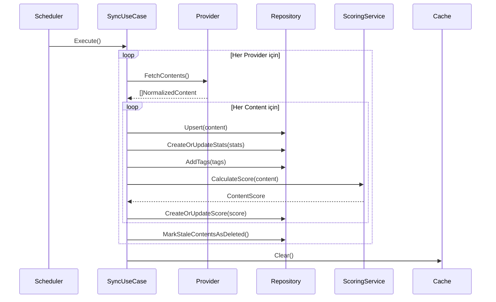
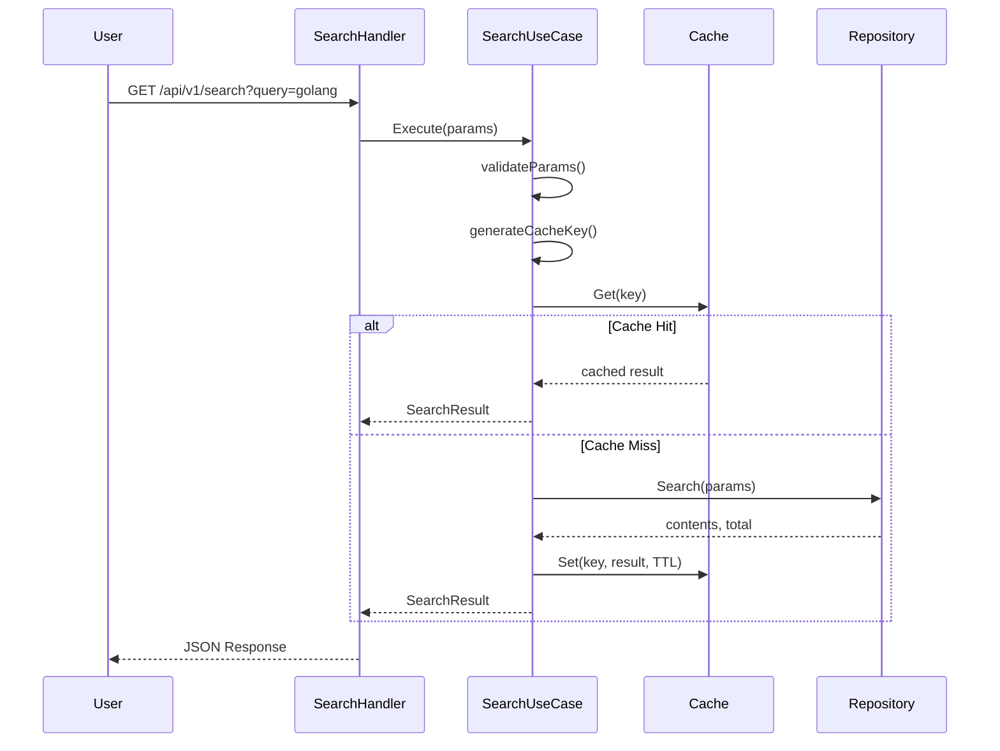
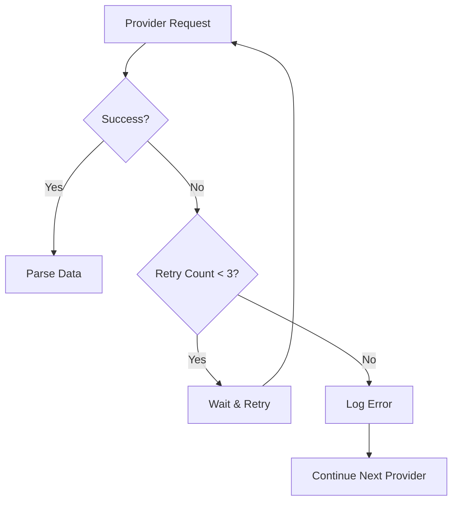

# 🔄 Veri Akışı

## Senkronizasyon Akışı

Provider'lardan veri toplama, normalizasyon ve skorlama işlemlerinin tamamı.

### Akış Diyagramı



### Adım Adım Açıklama

#### 1. Scheduler Tetikleme
```go
ticker := time.NewTicker(time.Duration(intervalSeconds) * time.Second)
go func() {
    for range ticker.C {
        syncUseCase.Execute(ctx)
    }
}()
```

Belirli aralıklarla (varsayılan: **1 saat**) senkronizasyon otomatik başlatılır.

#### 2. Provider'dan Veri Çekme

```go
func (p *jsonProvider) FetchContents(ctx context.Context) ([]*entity.NormalizedContent, error) {
    var allNormalized []*entity.NormalizedContent
    var page int = 1
    
    for page <= totalPages {
        // Rate limiter bekle
        p.limiter.Wait(ctx)
        
        // Sayfayı çek
        url := fmt.Sprintf("%s?page=%d", p.apiURL, page)
        resp, err := http.Get(url)
        
        // Parse ve normalize et
        // ...
        
        page++
    }
    
    return allNormalized, nil
}
```

Her provider'dan **pagination** ile tüm içerikler çekilir.

#### 3. Normalizasyon

Farklı formatlardaki veriler ortak yapıya dönüştürülür:

```go
type NormalizedContent struct {
    ExternalID  string
    Title       string
    Description string
    ContentType ContentType
    PublishedAt time.Time
    Stats       ContentStats
    Tags        []string
    RawData     string
}
```

#### 4. Upsert İşlemi

```sql
INSERT INTO contents (provider_id, provider_content_id, title, ...)
VALUES ($1, $2, $3, ...)
ON CONFLICT (provider_id, provider_content_id)
DO UPDATE SET
    title = EXCLUDED.title,
    ...
```

Mevcut içerikler **güncellenir**, yeniler **eklenir**.

#### 5. Skorlama

Her içerik için skor hesaplanır:

```
Final Score = (Base Score × Type Weight) + Recency Score + Engagement Score
```

#### 6. Stale Data Temizleme

```go
func (r *postgresContentRepository) MarkStaleContentsAsDeleted(
    ctx context.Context, 
    providerID int64, 
    threshold time.Time,
) error {
    query := `
        UPDATE contents 
        SET deleted = 1
        WHERE provider_id = $1 AND updated_at < $2 AND deleted = 0
    `
    // ...
}
```

Provider'dan **artık gelmeyen** içerikler silinmiş olarak işaretlenir.

#### 7. Cache Invalidation

Senkronizasyon sonrası tüm cache'ler temizlenir.

## Arama Akışı

Kullanıcı araması yapıldığında gerçekleşen işlemler.

### Akış Diyagramı



### Adım Adım Açıklama

#### 1. Parametre Validasyonu

```go
func (uc *SearchContentsUseCase) validateParams(params *port.SearchParams) error {
    // Page minimum 1
    if params.Page < 1 {
        params.Page = 1
    }
    
    // PageSize varsayılan ve maksimum
    if params.PageSize < 1 {
        params.PageSize = 20
    }
    if params.PageSize > 50 {
        params.PageSize = 50
    }
    
    // SortBy geçerli değer kontrolü
    if params.SortBy != "popularity" && params.SortBy != "relevance" {
        return fmt.Errorf("geçersiz sıralama: %s", params.SortBy)
    }
    
    return nil
}
```

#### 2. Cache Key Generation

```go
func generateCacheKey(params SearchParams) string {
    key := fmt.Sprintf("search:%s:%s:%s:%d:%d",
        params.Query,
        params.ContentType,
        params.SortBy,
        params.Page,
        params.PageSize,
    )
    
    hash := md5.Sum([]byte(key))
    return fmt.Sprintf("search:%x", hash)
}
```

Her arama parametresi kombinasyonu için **benzersiz** bir key üretilir.

#### 3. Cache Kontrolü

```go
if cached, err := uc.cache.Get(ctx, cacheKey); err == nil {
    var result SearchResult
    if err := json.Unmarshal(cached, &result); err == nil {
        return &result, nil  // Cache hit!
    }
}
```

Cache hit durumunda database'e **gidilmez**.

#### 4. Database Sorgusu

Cache miss durumunda PostgreSQL full-text search:

```sql
SELECT 
    c.id, c.title,
    ts_rank_cd('{0.1, 0.2, 0.4, 1.0}', search_vector, query) as relevance_score
FROM contents c
LEFT JOIN content_scores csc ON c.id = csc.content_id
WHERE search_vector @@ to_tsquery('english', 'golang:*')
ORDER BY 
    CASE 
        WHEN sort = 'relevance' THEN relevance_score
        ELSE csc.final_score
    END DESC
LIMIT 20 OFFSET 0;
```

#### 5. Sonuç Cache'leme

```go
if data, err := json.Marshal(result); err == nil {
    _ = uc.cache.Set(ctx, cacheKey, data, uc.cacheTTL)
}
```

Sonuç **60 saniye** süreyle cache'lenir.

## Provider Integration Akışı

Yeni bir provider eklerken izlenecek adımlar.

### 1. Provider Kaydı

```sql
INSERT INTO providers (name, url, format, is_active) 
VALUES ('New Provider', 'http://api.example.com/v1/contents', 'json', true);
```

### 2. Provider Client Oluşturma

Sistem otomatik olarak provider client oluşturur:

```go
func createProviderClients(db *sql.DB) []port.ProviderClient {
    rows, _ := db.Query("SELECT id, name, url, format FROM providers WHERE is_active = true")
    
    var clients []port.ProviderClient
    for rows.Next() {
        var p entity.Provider
        rows.Scan(&p.ID, &p.Name, &p.URL, &p.Format)
        
        switch p.Format {
        case "json":
            clients = append(clients, provider.NewJSONProvider(&p, p.URL))
        case "xml":
            clients = append(clients, provider.NewXMLProvider(&p, p.URL))
        }
    }
    
    return clients
}
```

### 3. Otomatik Senkronizasyon

Yeni provider **otomatik olarak** senkronizasyon döngüsüne eklenir.

## Error Handling Akışı

Hata durumlarında sistem nasıl davranır?

### Provider Hatası



### Database Hatası

```go
tx, err := db.BeginTx(ctx, nil)
if err != nil {
    return fmt.Errorf("transaction başlatılamadı: %w", err)
}
defer tx.Rollback()  // Hata durumunda otomatik rollback

// İşlemler...

if err := tx.Commit(); err != nil {
    return fmt.Errorf("transaction commit hatası: %w", err)
}
```

### Cache Hatası

```go
// Cache hatası kritik değil, devam et
if cached, err := cache.Get(ctx, key); err != nil {
    log.Printf("Cache hatası: %v (devam ediliyor)", err)
    // Database'den çek
}
```

## Monitoring ve Logging

### Senkronizasyon Logları

```
✓ Provider 1 senkronizasyonu başladı
✓ 50 içerik çekildi
✓ 50 içerik kaydedildi
✓ 50 skor hesaplandı
✓ Provider 1 senkronizasyonu tamamlandı (2.5s)
```

### Arama Logları

```
Arama yapılıyor: Query=golang, Sort=popularity, Page=1
Cache miss - Database sorgusu yapılıyor
150 sonuç bulundu
Cache'e kaydedildi: search:a1b2c3d4
Yanıt süresi: 45ms
```

### Sync Log Tablosu

```sql
CREATE TABLE provider_sync_logs (
    id SERIAL PRIMARY KEY,
    provider_id INTEGER,
    started_at TIMESTAMP,
    completed_at TIMESTAMP,
    status VARCHAR(20),  -- 'success', 'failed', 'running'
    items_synced INTEGER,
    error_message TEXT
);
```

Bu tablo ile senkronizasyon geçmişi **takip edilir** ve **analiz edilir**.
