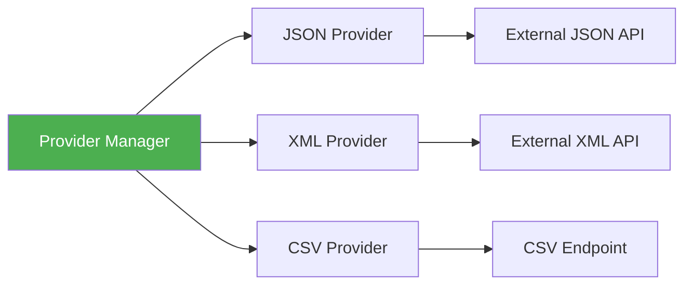
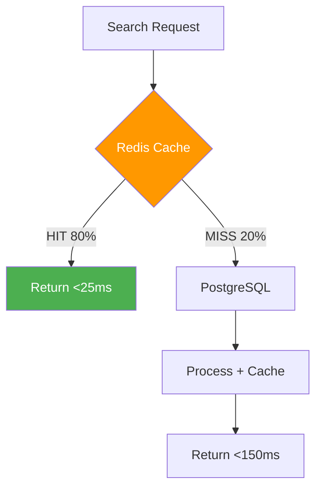

# ⚡ Öne Çıkan Özellikler

Bu bölümde projenin temel özelliklerini, implementasyon detaylarını ve arkasındaki tasarım kararlarını inceleyeceğiz.

## 1. 🌐 Çok Kaynaklı Veri Entegrasyonu

### Problem

Modern uygulamalar genellikle birden fazla veri kaynağından beslenir:
- E-ticaret: Ürün verileri, kullanıcı yorumları, blog içerikleri
- Medya: Video platformları, podcast servisleri, makale siteleri  
- Kurumsal: Farklı departman sistemleri, legacy API'ler

Her kaynak farklı format (JSON, XML, CSV) ve farklı yapıda veri sunar.

### Çözüm: Dinamik Provider Sistemi

**Strategy Pattern** kullanarak esnek bir provider mimarisi:



#### Provider Interface

```go
// Tüm provider'lar bu interface'i implement eder
type ProviderClient interface {
    FetchContents(ctx context.Context) ([]*entity.NormalizedContent, error)
    GetProviderInfo() *entity.Provider
}
```

#### JSON Provider Implementation

```go
type jsonProvider struct {
    provider *entity.Provider
    apiURL   string
    limiter  *rate.Limiter  // Provider başına rate limiting
}

func (p *jsonProvider) FetchContents(ctx context.Context) ([]*entity.NormalizedContent, error) {
    var allContents []*entity.NormalizedContent
    page := 1
    maxRetries := 3
    
    logger.Info("Starting provider fetch",
        zap.String("provider", p.provider.Name),
        zap.String("url", p.apiURL))
    
    for {
        // 1. Rate Limiter - Provider'a fazla yük bindirme
        if err := p.limiter.Wait(ctx); err != nil {
            return nil, fmt.Errorf("rate limiter error: %w", err)
        }
        
        // 2. Fetch page with retry
        url := fmt.Sprintf("%s?page=%d", p.apiURL, page)
        contents, hasMore, err := p.fetchPageWithRetry(ctx, url, maxRetries)
        if err != nil {
            return nil, err
        }
        
        // 3. Normalize and accumulate
        for _, content := range contents {
            normalized := p.normalize(content)
            allContents = append(allContents, normalized)
        }
        
        // 4. Check pagination
        if !hasMore {
            break
        }
        page++
        
        // Safety check
        if page > 1000 {
            logger.Warn("Max page limit reached", zap.Int("page", page))
            break
        }
    }
    
    logger.Info("Provider fetch completed",
        zap.String("provider", p.provider.Name),
        zap.Int("items", len(allContents)))
    
    return allContents, nil
}
```

#### Exponential Backoff Retry

```go
func (p *jsonProvider) fetchPageWithRetry(
    ctx context.Context,
    url string,
    maxRetries int,
) ([]JSONContent, bool, error) {
    var lastErr error
    
    for attempt := 0; attempt < maxRetries; attempt++ {
        if attempt > 0 {
            // Exponential backoff: 1s, 2s, 4s, 8s...
            backoff := time.Duration(1<<uint(attempt)) * time.Second
            logger.Info("Retrying after backoff",
                zap.Int("attempt", attempt+1),
                zap.Duration("backoff", backoff))
            
            select {
            case <-time.After(backoff):
            case <-ctx.Done():
                return nil, false, ctx.Err()
            }
        }
        
        contents, hasMore, err := p.fetchPage(ctx, url)
        if err == nil {
            return contents, hasMore, nil
        }
        
        lastErr = err
        logger.Warn("Fetch failed, will retry",
            zap.String("url", url),
            zap.Error(err),
            zap.Int("attempt", attempt+1))
    }
    
    return nil, false, fmt.Errorf("max retries exceeded: %w", lastErr)
}
```

#### Veri Normalizasyonu

```go
func (p *jsonProvider) normalize(raw JSONContent) *entity.NormalizedContent {
    // Raw data'yı JSON olarak sakla (debugging için)
    rawData, _ := json.Marshal(raw)
    
    return &entity.NormalizedContent{
        Content: &entity.Content{
            ProviderID:   p.provider.ID,
            ExternalID:   raw.ID,
            Title:        raw.Title,
            Description:  raw.Description,
            ContentType:  p.mapContentType(raw.Type),
            PublishedAt:  p.parseDate(raw.PublishedDate),
            RawData:      string(rawData),  // Audit trail
        },
        Stats: &entity.ContentStats{
            Views:       raw.Views,
            Likes:       int32(raw.Likes),
            ReadingTime: int32(raw.ReadingTime),
            Reactions:   int32(raw.Reactions),
        },
        Tags: raw.Tags,
    }
}
```

### Yeni Provider Ekleme

**Adım 1:** Provider'ı database'e kaydet

```sql
INSERT INTO providers (name, url, format, is_active) 
VALUES ('New Content Source', 'https://api.newsource.com/v1/contents', 'json', true);
```

**Adım 2:** Otomatik olarak sisteme dahil olur! 🎉

```go
// main.go - Sistem her başladığında provider'ları yükler
func createProviderClients(db *sql.DB) []port.ProviderClient {
    rows, _ := db.Query(`
        SELECT id, name, url, format 
        FROM providers 
        WHERE is_active = true
    `)
    
    var clients []port.ProviderClient
    for rows.Next() {
        var p entity.Provider
        rows.Scan(&p.ID, &p.Name, &p.URL, &p.Format)
        
        // Format'a göre uygun provider oluştur
        switch p.Format {
        case "json":
            clients = append(clients, provider.NewJSONProvider(&p, p.URL))
        case "xml":
            clients = append(clients, provider.NewXMLProvider(&p, p.URL))
        }
    }
    
    return clients
}
```

### Özellikler

::list{type="success"}
- **Dinamik Provider Yönetimi**: Kod değişikliği olmadan yeni kaynak ekleme
- **Otomatik Pagination**: Tüm sayfaları otomatik çeker
- **Rate Limiting**: Provider başına saniyede 1 istek (konfigüre edilebilir)
- **Retry Mekanizması**: Exponential backoff ile akıllı yeniden deneme
- **Raw Data Preservation**: Debugging ve audit için orijinal veri saklanır
- **Context Support**: Timeout ve cancellation desteği
::

## 2. 🧠 Akıllı Skorlama Algoritması

### Problem

Arama sonuçlarını nasıl sıralamalı? Sadece tarih mi, popülerlik mi, yoksa alakalılık mı?

- **Sadece tarih**: En yeni içerik her zaman kaliteli değil
- **Sadece görüntülenme**: Eski virallar sürekli üstte kalır
- **Sadece relevance**: Kalitesiz ama alakalı içerikler çıkar

### Çözüm: Çok Boyutlu Skorlama

```
Final Score = (Base Score × Type Weight) + Recency Bonus + Engagement Score
```

### Bileşenler

#### A) Base Score (Temel Puan)

**Video İçerikler:**
```go
baseScore = (views / 1000) + (likes / 100)

// Örnek:
// 150,000 görüntülenme → 150 puan
// 5,000 beğeni → 50 puan
// Base Score = 200
```

**Makale İçer ikler:**
```go
baseScore = readingTime + (reactions / 50)

// Örnek:
// 15 dakika okuma süresi → 15 puan
// 250 reaction → 5 puan
// Base Score = 20
```

::alert{type="info"}
**Neden farklı formüller?**
- Video'larda **görüntülenme** en önemli metrik
- Makalelerde **okuma süresi** (content depth) daha değerli
::

#### B) Type Weight (Tür Ağırlığı)

```go
type ScoringRules struct {
    VideoTypeWeight   float64  // 1.5x - Videolar daha popüler
    ArticleTypeWeight float64  // 1.0x - Makaleler standart
}
```

**Neden video ağırlığı daha yüksek?**
- Video üretimi daha maliyetli
- Kullanıcı engagement'ı genelde daha yüksek
- Platform stratejisine göre ayarlanabilir

#### C) Recency Score (Güncellik Bonusu)

```go
func (s *scoringService) calculateRecencyScore(publishedAt time.Time) float64 {
    age := time.Since(publishedAt)
    
    switch {
    case age < 7*24*time.Hour:    // 1 hafta
        return 5.0  // Çok güncel! 🔥
    case age < 30*24*time.Hour:   // 1 ay
        return 3.0  // Güncel ✨
    case age < 90*24*time.Hour:   // 3 ay
        return 1.0  // Hala relevant
    default:
        return 0.0  // Standart
    }
}
```

**Görsel:**

```
Recency Score
  5 |████████░░░░░░░░░░░░░░░░░░░░
  4 |████████░░░░░░░░░░░░░░░░░░░░
  3 |████████░░░░░░░░░░░░░░░░░░░░
  2 |        ████████░░░░░░░░░░░░
  1 |        ████████░░░░░░░░░░░░
  0 |                ████████████
    +---------------------------------
      1w      1m      3m      6m+
```

#### D) Engagement Score (Etkileşim Puanı)

```go
func (s *scoringService) calculateEngagementScore(content *entity.Content) float64 {
    if content.ContentType == entity.ContentTypeVideo {
        // Like rate: Beğenme oranı
        if content.Stats.Views > 0 {
            likeRate := float64(content.Stats.Likes) / float64(content.Stats.Views)
            return likeRate * 10.0  // 0-10 arası normalize
        }
    } else {
        // Reaction per minute
        if content.Stats.ReadingTime > 0 {
            reactionRate := float64(content.Stats.Reactions) / float64(content.Stats.ReadingTime)
            return reactionRate * 5.0
        }
    }
    
    return 0.0
}
```

**Mantık:**
- Yüksek etkileşim oranı = Kalitelcontentİçerik
- %3.3 like rate → Mükemmel 🌟
- %0.1 like rate → Düşük kalite

### Gerçek Örnek

**Video: "Go Programming Tutorial"**

```go
Stats:
- Views:       150,000
- Likes:       5,000
- Published:   5 days ago
- Type:        Video

Hesaplama:
1. Base Score     = (150000/1000) + (5000/100) = 150 + 50 = 200
2. Type Weight    = 1.5x (Video)
3. Weighted Score = 200 × 1.5 = 300
4. Recency Bonus  = +5.0 (< 1 week)
5. Engagement     = (5000/150000) × 10 = 0.333 × 10 = +3.3

Final Score = 300 + 5.0 + 3.3 = 308.3 🎯
```

**Makale: "Understanding Clean Architecture"**

```go
Stats:
- Reading Time: 15 min
- Reactions:    250
- Published:    15 days ago
- Type:         Article

Hesaplama:
1.Base Score     = 15 + (250/50) = 15 + 5 = 20
2. Type Weight    = 1.0x (Article)
3. Weighted Score = 20 × 1.0 = 20
4. Recency Bonus  = +3.0 (< 1 month)
5. Engagement     = (250/15) × 5 = 16.67 × 5 = +83.35

Final Score = 20 + 3.0 + 83.35 = 106.35
```

### Implementation

```go
type scoringService struct {
    videoTypeWeight   float64
    articleTypeWeight float64
}

func (s *scoringService) CalculateScore(
    content *entity.Content,
) (*entity.ContentScore, error) {
    score := &entity.ContentScore{
        ContentID:    content.ID,
        CalculatedAt: time.Now(),
    }
    
    // Base score
    if content.ContentType == entity.ContentTypeVideo {
        score.BaseScore = float64(content.Stats.Views)/1000.0 + 
                         float64(content.Stats.Likes)/100.0
        score.TypeWeight = s.videoTypeWeight
    } else {
        score.BaseScore = float64(content.Stats.ReadingTime) + 
                         float64(content.Stats.Reactions)/50.0
        score.TypeWeight = s.articleTypeWeight
    }
    
    // Bonus scores
    score.RecencyScore = s.calculateRecencyScore(content.PublishedAt)
    score.EngagementScore = s.calculateEngagementScore(content)
    
    // Final score
    score.FinalScore = (score.BaseScore * score.TypeWeight) + 
                       score.RecencyScore + 
                       score.EngagementScore
    
    return score, nil
}
```

### Sonuç

::alert{type="success"}
Bu algoritma sayesinde:
- ✅ **Kaliteli** içerikler öne çıkar (engagement yüksek)
- ✅ **Güncel** içerikler boost alır (recency bonus)
- ✅ **Popüler** içerikler avantajlı (base score)
- ✅ **Dengeli** sonuçlar (çok boyutlu metrikler)
::

## 3. 🔎 PostgreSQL Full-Text Search

### Sorun

Basit `LIKE` sorguları:
- ❌ Yavaş (index kullanamaz)
- ❌ Esnek değil ("golang" araması "Go" içeriği bulamaz)
- ❌ Relevance score yok

### Çözüm: PostgreSQL FTS + GIN İndeks

#### Ağırlıklı Search Vector

```sql
-- Migration'da oluşturuluyor
ALTER TABLE contents 
ADD COLUMN search_vector tsvector
GENERATED ALWAYS AS (
    setweight(to_tsvector('english', COALESCE(title, '')), 'A') ||
    setweight(to_tsvector('english', COALESCE(description, '')), 'C')
) STORED;

-- GIN indeks (ÇOOK hızlı!)
CREATE INDEX idx_contents_search 
ON contents USING GIN(search_vector);
```

**Ağırlıklar:**
| Bölüm | Ağırlık | Kullanım |
|-------|---------|----------|
| A | 1.0 | Title |
| B | 0.4 | Tags |
| C | 0.2 | Description |
| D | 0.1 | Diğer |

#### Prefix Matching

```go
// "gol" araması
cleanedWords := []string{"gol"}
tsquery := "gol:*"  // Prefix operator

// Bu şunları bulur:
// ✅ "golang"
// ✅ "golden"
// ✅ "golf"
// ❌ "algorithm" (prefix değil)
```

```sql
SELECT * FROM contents
WHERE search_vector @@ to_tsquery('english', 'gol:*')
```

#### Özel Karakter Sanitizasyonu

FTS syntax hatalarını önle:

```go
func sanitizeSearchQuery(query string) string {
    // Sadece alfanumerik karakterleri tut
    cleaner := func(r rune) rune {
        if (r >= 'a' && r <= 'z') || 
           (r >= 'A' && r <= 'Z') || 
           (r >= '0' && r <= '9') || 
           r == ' ' {
            return r
        }
        return -1  // Çıkar
    }
    
    cleaned := strings.Map(cleaner, query)
    
    // Birden fazla boşluğu tek boşluğa indir
    cleaned = strings.Join(strings.Fields(cleaned), " ")
    
    return strings.TrimSpace(cleaned)
}

// Örnek:
// "Go & Programming!" → "Go Programming"
// "C++ tutorial" → "C tutorial"
```

#### Relevance Ranking

```sql
SELECT 
    c.id,
    c.title,
    -- ts_rank_cd: weighted density ranking
    ts_rank_cd(
        '{0.1, 0.2, 0.4, 1.0}'::float[],  -- D, C, B, A ağırlıkları
        c.search_vector,
        to_tsquery('english', 'golang:* & tutorial:*')
    ) as relevance_score
FROM contents c
WHERE c.search_vector @@ to_tsquery('english', 'golang:* & tutorial:*')
ORDER BY relevance_score DESC;
```

**Örnek Sonuçlar:**

| Title | Match | Relevance |
|-------|-------|-----------|
| "**Golang** **Tutorial** for Beginners" | Title + Title | 0.95 |
| "**Golang** Best Practices" | Title | 0.72 |
| "Advanced **Tutorial**: Learn Go" | Title (partial) | 0.48 |
| "Programming with #**golang**" | Tags | 0.31 |

### Tam Arama Sorgusu

```sql
SELECT 
    c.id,
    c.title,
    c.description,
    c.content_type,
    c.published_at,
    csc.final_score,
    ts_rank_cd(
        '{0.1, 0.2, 0.4, 1.0}',
        c.search_vector,
        to_tsquery('english', $1)
    ) as relevance_score,
    COALESCE(cst.views, 0) as views,
    COALESCE(cst.likes, 0) as likes
FROM contents c
LEFT JOIN content_scores csc ON c.id = csc.content_id
LEFT JOIN content_stats cst ON c.id = cst.content_id
WHERE 
    ($1 = '' OR c.search_vector @@ to_tsquery('english', $1))
    AND ($2 = '' OR c.content_type = $2)
    AND c.deleted = 0
ORDER BY
    CASE 
        WHEN $3 = 'relevance' THEN relevance_score
        WHEN $3 = 'popularity' THEN csc.final_score
        ELSE c.published_at
    END DESC
LIMIT $4 OFFSET $5;
```

### Performance

```
EXPLAIN ANALYZE SELECT ...
→ Bitmap Index Scan on idx_contents_search (cost=12.5..2500)
→ Planning Time: 0.1ms
→ Execution Time: 8.3ms  ⚡
```

Vs. LIKE sorgusu:
```
→ Seq Scan on contents (cost=0..50000)  🐌
→ Execution Time: 450ms
```

**54x daha hızlı!**

## 4. ⚡ Üç Katmanlı Cache Stratejisi

### Cache Layers



### Cache Key Generation

```go
func generateCacheKey(params SearchParams) string {
    // Tüm parametreleri içeren unique key
    key := fmt.Sprintf("search:%s:%s:%s:%d:%d",
        params.Query,
        params.ContentType,
        params.SortBy,
        params.Page,
        params.PageSize,
    )
    
    // MD5 hash (collision riski çok düşük)
    hash := md5.Sum([]byte(key))
    return fmt.Sprintf("search:%x", hash)
}

// Örnek keys:
// "search:ab12cd34ef56..."
// "search:78gh90ij12kl..."
```

### Cache Flow

```go
func (uc *SearchContentsUseCase) Execute(
    ctx context.Context,
    params port.SearchParams,
) (*usecase.SearchResult, error) {
    // 1. Cache key oluştur
    cacheKey := generateCacheKey(params)
    
    // 2. Cache'den dene
    var result usecase.SearchResult
    if err := uc.cache.Get(ctx, cacheKey, &result); err == nil {
        metrics.CacheHits.Inc()
        logger.Debug("Cache hit", zap.String("key", cacheKey))
        return &result, nil  // 🎯 Cache hit! <25ms
    }
    
    // 3. Cache miss - Database
    metrics.CacheMisses.Inc()
    logger.Debug("Cache miss", zap.String("key", cacheKey))
    
    contents, total, err := uc.contentRepo.Search(ctx, params)
    if err != nil {
        return nil, err
    }
    
    result = usecase.SearchResult{
        Items:      contents,
       Pagination: buildPagination(params, total),
    }
    
    // 4. Cache'e kaydet (fire-and-forget)
    go func() {
        _ = uc.cache.Set(context.Background(), cacheKey, result, uc.cacheTTL)
    }()
    
    return &result, nil  // Database result <150ms
}
```

### Cache Invalidation

**Senkronizasyon sonrası:**

```go
func (uc *SyncProviderContentsUseCase) Execute(ctx context.Context) error {
    // Provider sync...
    
    // Tüm search cache'lerini temizle
    if err := uc.cache.Clear(ctx); err != nil {
        logger.Error("Cache invalidation failed", zap.Error(err))
    }
    
    return nil
}
```

**Pattern-based deletion:**

```go
func (c *redisCache) Clear(ctx context.Context) error {
    iter := c.client.Scan(ctx, 0, "search:*", 0).Iterator()
    
    for iter.Next(ctx) {
        if err := c.client.Del(ctx, iter.Val()).Err(); err != nil {
            return err
        }
    }
    
    return iter.Err()
}
```

### TTL Stratejisi

```go
// Konfigürasyon
cacheTTL := 60 * time.Second  // Default: 1 dakika

// Popüler aramalar için daha uzun TTL (future enhancement)
if isPopularQuery(params.Query) {
    cacheTTL = 5 * time.Minute
}
```

## 5. 🛡️ İki Seviyeli Rate Limiting

### A) API Level Rate Limiting

Client başına rate limit:

```go
type RateLimiter struct {
    limiters map[string]*rate.Limiter  // IP → Limiter
    mu       sync.RWMutex
    rate     int  // requests per minute
}

func (rl *RateLimiter) Middleware(next http.Handler) http.Handler {
    return http.HandlerFunc(func(w http.ResponseWriter, r *http.Request) {
        ip := getClientIP(r)
        
        limiter := rl.getLimiter(ip)
        
        if !limiter.Allow() {
            // Rate limit aşıldı!
            w.Header().Set("X-RateLimit-Limit", "60")
            w.Header().Set("X-RateLimit-Remaining", "0")
            w.Header().Set("Retry-After", "60")
            
            http.Error(w, "Rate limit exceeded", http.StatusTooManyRequests)
            return
        }
        
        next.ServeHTTP(w, r)
    })
}
```

### B) Provider Level Rate Limiting

Provider API'lerine fazla yük bindirmeme:

```go
type jsonProvider struct {
    provider *entity.Provider
    apiURL   string
    limiter  *rate.Limiter  // Saniyede 1 istek
}

func NewJSONProvider(p *entity.Provider, url string) *jsonProvider {
    return &jsonProvider{
        provider: p,
        apiURL:   url,
        limiter:  rate.NewLimiter(rate.Every(time.Second), 1),  // 1 req/s
    }
}

func (p *jsonProvider) fetchPage(ctx context.Context, url string) error {
    // Rate limiter - bekle gerekirse
    if err := p.limiter.Wait(ctx); err != nil {
        return err
    }
    
    // Request yap...
}
```

### Neden İki Seviye?

::list{type="info"}
- **API Level**: Kendi sistemimizi korumak için
- **Provider Level**: External API'lere saygılı olmak için
::

## 📊 Özet

Bu özellikler sayesinde sistem:

- ✅ **Esnek**: Yeni provider'lar kolayca eklenir
- ✅ **Akıllı**: Çok boyutlu skorlama ile kaliteli sonuçlar
- ✅ **Hızlı**: FTS + Cache ile <100ms response
- ✅ **Güvenilir**: Rate limiting + Retry mekanizması
- ✅ **Sürdürülebilir**: Clean Architecture + Test coverage

Her özellik gerçek problemlere somut çözümler sunar! 🚀
