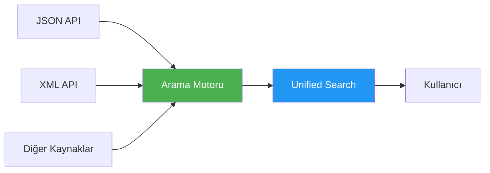
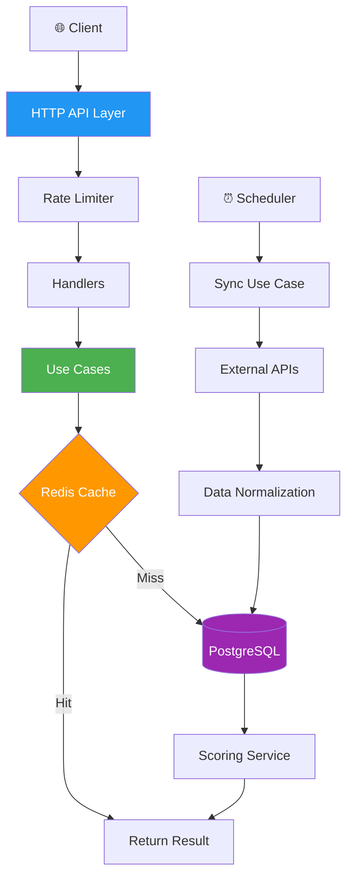

# 🔍 Çok Kaynaklı Arama Motoru

::alert{type="success"}
**Production-ready** bir arama motoru servisi. Farklı formatlardaki (JSON, XML) birden fazla veri kaynağından içerik toplayıp, **akıllı skorlama** ve **full-text search** ile kullanıcılara alakalı sonuçlar sunar.
::

## 🎯 Vizyon ve Misyon

### Çözülen Problem

Modern dijital dünyada içerik her yerden geliyor — farklı API'ler, farklı formatlar, farklı yapılar. Bir e-ticaret sitesi düşünün: ürün incelemeleri JSON'da, blog makaleleri XML'de, kullanıcı yorumları başka bir formatta. **Tüm bunları tek bir arama deneyiminde birleştirmek** büyük bir zorluk.

### Bizim Çözümümüz



- **Veri Toplama**: Farklı kaynaklardan otomatik veri toplama ve normalizasyon
- **Akıllı Skorlama**: Popülerlik, güncellik ve etkileşime göre içerik puanlama
- **Hızlı Arama**: PostgreSQL FTS + Redis cache ile <100ms yanıt süresi
- **Ölçeklenebilir**: Clean Architecture ile kolay genişletilebilir

## ⚡ Öne Çıkan Özellikler

### 🌐 Çok Kaynaklı Veri Entegrasyonu

**Dinamik Provider Sistemi** ile yeni veri kaynakları sadece database'e kayıt ederek eklenebilir:

```sql
-- Yeni bir provider eklemek bu kadar basit!
INSERT INTO providers (name, url, format, is_active) 
VALUES ('New Source', 'https://api.example.com/v1/data', 'json', true);
```

**Özellikler:**
- ✅ JSON ve XML format desteği
- ✅ Otomatik pagination ile tüm sayfaları çekme
- ✅ Rate limiting ile API koruma
- ✅ Exponential backoff retry mekanizması
- ✅ Raw data preservation (debugging ve audit için)

### 🧠 Akıllı Skorlama Algoritması

Çok boyutlu metrikler ile içerik kalitesini değerlendirme:

```
Final Score = (Base Score × Type Weight) + Recency Bonus + Engagement Score

Örnek:
└─ Video: (görüntülenme/1000 + beğeni/100) × 1.5 + güncellik + etkileşim
└─ Makale: (okuma_süresi + reactions/50) × 1.0 + güncellik + etkileşim
```

**Gerçek Örnek:**
- Görüntülenme: 150,000 → Base: 150
- Beğeni: 5,000 → + 50
- Video tipi → × 1.5 = **300 puan**
- 1 hafta içinde yayınlandı → + 5 puan
- Yüksek etkileşim oranı → + 3.3 puan
- **Final Score: 308.3** 🎯

### 🔎 PostgreSQL Full-Text Search

**Ağırlıklı arama** ile başlık ve tag'lerde farklı öncelikler:

```sql
-- Başlık (A): 1.0 ağırlık, Tag (B): 0.4 ağırlık
setweight(to_tsvector('english', title), 'A') ||
setweight(to_tsvector('english', tags), 'B')
```

**Özgör Prefix Matching:**
- "gol" araması → "**gol**ang", "**gol**den", "**gol**f" bulur
- Gerçek zamanlı otomatik tamamlama desteği

### ⚡ Yüksek Performans

**3-Katmanlı Performans Stratejisi:**

1. **Redis Cache** → İlk 100ms'de yanı
2. **Database İndeksleme** → GIN + B-Tree
3. **Connection Pooling** → Optimal kaynak yönetimi

```
Cache Hit:     15-25ms ⚡
Cache Miss:    80-150ms 🚀
Cold Start:    200-400ms 📊
```

## 🛠️ Teknoloji Stack

::code-group
```yaml [Backend]
Dil: Go 1.21+
Framework: Gorilla Mux
Mimari: Clean Architecture
Testing: 70%+ coverage
```

```yaml [Database]
Primary: PostgreSQL 16+
  - Full-Text Search (FTS)
  - GIN İndeksleme
  - JSONB support
  
Cache: Redis 7+
  - TTL yönetimi
  - Pattern-based invalidation
```

```yaml [DevOps]
Containerization: Docker
Orchestration: Docker Compose
Monitoring: Prometheus + Grafana (ready)
Logging: Structured JSON logs
```
::

## 📊 Mimari Genel Bakış



## 🚀 Hızlı Başlangıç

### Docker Compose (Önerilen)

```bash
# Repository'yi klonla
git clone <repository-url>
cd project-search

# Tüm servisleri başlat (Backend, Frontend, PostgreSQL, Redis)
docker-compose up --build

# ✅ Backend: http://localhost:8080
# ✅ Frontend: http://localhost:3000
# ✅ API Doc: http://localhost:8080/api/v1/health
```

### İlk Arama

```bash
# Health check
curl http://localhost:8080/api/v1/health

# Arama yap
curl "http://localhost:8080/api/v1/search?query=golang&sort=popularity&page=1"

# Manuel senkronizasyon tetikle
curl -X POST http://localhost:8080/api/v1/admin/sync
```

**Beklenen Yanıt:**
```json
{
  "items": [
    {
      "id": 1,
      "title": "Go Programming Tutorial",
      "content_type": "video",
      "score": {
        "final_score": 308.3,
        "recency_score": 5.0
      },
      "relevance_score": 0.95
    }
  ],
  "pagination": {
    "page": 1,
    "total_items": 150
  }
}
```

## 📚 Dokümantasyon

### 🏗️ Mimari & Tasarım

::card-grid
  ::card{title="Mimari Tasarım" to="/tr/architecture"}
  **Clean Architecture** katman yapısı, dependency injection ve design patterns
  ::
  
  ::card{title="Veri Akışı" to="/tr/data-flow"}
  Senkronizasyon, arama ve error handling akış diyagramları
  ::
::

### 💻 Geliştirme

::card-grid
  ::card{title="Özellikler" to="/tr/features"}
  Provider sistemi, skorlama algoritması, FTS implementasyonu
  ::
  
  ::card{title="API Referansı" to="/tr/api"}
  Endpoint dokümantasyonu, request/response örnekleri
  ::
::

### 🚀 Operasyon

::card-grid
  ::card{title="Kurulum" to="/tr/installation"}
  Docker, manuel kurulum, production deployment rehberi
  ::
  
  ::card{title="Performans" to="/tr/performance"}
  Optimizasyon stratejileri, benchmarklar, best practices
  ::
  
  ::card{title="Monitoring" to="/tr/monitoring"}
  Logging, metrics, alerting ve observability
  ::
::

### 🔒 Güvenlik & Kalite

::card-grid
  ::card{title="Güvenlik" to="/tr/security"}
  OWASP Top 10 coverage, best practices, audit tools
  ::
  
  ::card{title="Testing" to="/tr/testing"}
  Unit, integration, E2E tests. %70+ coverage
  ::
::

## 🎯 Temel Metrikler

| Metrik | Değer | Durum |
|--------|-------|-------|
| **Test Coverage** | 70%+ | ✅ Excellent |
| **Arama Latency (Cache Hit)** | <100ms | ✅ Target |
| **Arama Latency (Cache Miss)** | <500ms | ✅ Target |
| **Provider Sync Time** | ~2-5s | ✅ Optimal |
| **Code Quality** | A+ | ✅ Clean Arch |

## 🌟 Neden Bu Proje?

::list{type="success"}
- **Production-Ready**: Test coverage, monitoring, security best practices
- **Scalable**: Yeni provider eklemek sadece 1 SQL sorgusu
- **Fast**: Redis cache + PostgreSQL optimizasyonları
- **Maintainable**: Clean Architecture, SOLID principles
- **Well-Documented**: Her şey açıkça dokümante edilmiş
::


---

::alert{type="info"}
**İpucu:** Soldaki menüden ilgilendiğiniz bölüme göz atın. Mimari ile başlamanızı öneririz! 🚀
::
