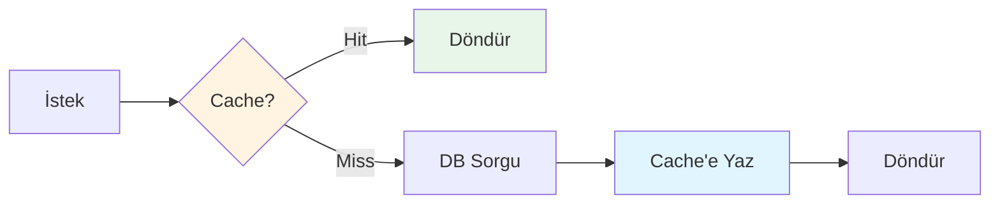

# 🚀 Performans Optimizasyonları

## 1. Database Optimizasyonları

### GIN İndeksleme

GIN (Generalized Inverted Index), full-text search için optimize edilmiş bir indeks türüdür.

```sql
-- Full-text search için GIN indeks
CREATE INDEX idx_contents_title ON contents 
USING GIN (to_tsvector('english', title));
```

**Avantajları:**
- ✅ Hızlı full-text search
- ✅ Birden fazla kelime araması
- ✅ Prefix matching desteği

### B-Tree İndeksleme

Sıralama ve filtreleme işlemleri için B-Tree indeksler kullanılır.

```sql
-- Sıralama için indeks
CREATE INDEX idx_contents_published ON contents(published_at DESC);

-- Filtreleme için indeks
CREATE INDEX idx_contents_type ON contents(content_type);

-- Final score için indeks
CREATE INDEX idx_scores_final ON content_scores(final_score DESC);
```

### Composite İndeks

Birden fazla sütunu içeren indeksler, karmaşık sorguları hızlandırır.

```sql
-- Tür ve skor bazlı sorgular için
CREATE INDEX idx_content_type_score 
ON contents(content_type, final_score DESC);
```

### Partial İndeks

Sadece belirli koşulları sağlayan satırları indeksler.

```sql
-- Sadece aktif içerikleri indeksle
CREATE INDEX idx_active_contents 
ON contents(published_at DESC) 
WHERE deleted = 0;
```

**Avantajları:**
- ✅ Daha küçük indeks boyutu
- ✅ Daha hızlı indeks taraması
- ✅ Daha az disk alanı

### Connection Pooling

Veritabanı bağlantı havuzu oluşturarak performansı artırır.

```go
db.SetMaxOpenConns(25)       // Maksimum açık bağlantı
db.SetMaxIdleConns(5)        // Boşta tutulacak bağlantı
db.SetConnMaxLifetime(5 * time.Minute)  // Bağlantı yaşam süresi
```

**Ayarlama İpuçları:**
- `MaxOpenConns`: CPU core sayısı × 2-3
- `MaxIdleConns`: MaxOpenConns'in %20-25'i
- `ConnMaxLifetime`: 5-15 dakika arası

## 2. Cache Stratejileri

### Cache Warming

Popüler aramaları önceden cache'lemek.

```go
func warmCache() {
    popularQueries := []string{"golang", "tutorial", "javascript"}
    
    for _, query := range popularQueries {
        params := SearchParams{Query: query}
        searchUseCase.Execute(ctx, params)
    }
}
```

### Cache Invalidation

Veri değiştiğinde cache'i temizleme.

```go
// Senkronizasyon sonrası tüm cache'i temizle
func (uc *SyncProviderContentsUseCase) Execute(ctx context.Context) error {
    // ... senkronizasyon işlemleri
    
    // Cache'i temizle
    uc.cache.Clear(ctx)
    
    return nil
}
```

### TTL Tuning

Kullanım desenlerine göre TTL ayarlama.

**Stratejiler:**
- **Popüler aramalar**: Daha uzun TTL (5-10 dakika)
- **Genel aramalar**: Standart TTL (60 saniye)
- **Admin işlemleri**: Cache kullanma

### Cache-Aside Pattern



## 3. Query Optimization

### EXPLAIN ANALYZE

Sorgu performansını analiz etme.

```sql
EXPLAIN ANALYZE
SELECT * FROM contents
WHERE to_tsvector('english', title) @@ to_tsquery('golang:*')
ORDER BY final_score DESC
LIMIT 20;
```

**Çıktı Analizi:**
- **Seq Scan**: İndeks kullanılmıyor (kötü)
- **Index Scan**: İndeks kullanılıyor (iyi)
- **Bitmap Index Scan**: GIN indeks kullanılıyor (çok iyi)

### N+1 Problem Çözümü

Tag'leri tek sorguda çekmek.

**Kötü (N+1):**
```go
for _, content := range contents {
    tags := loadTags(content.ID)  // Her content için 1 sorgu
    content.Tags = tags
}
```

**İyi (Single Query):**
```go
// Tüm tag'leri tek sorguda çek
tagMap := loadAllTagsForContents(contentIDs)
for _, content := range contents {
    content.Tags = tagMap[content.ID]
}
```

### Query Result Caching

PostgreSQL prepared statements kullanarak.

```go
stmt, err := db.Prepare(`
    SELECT * FROM contents 
    WHERE to_tsvector('english', title) @@ to_tsquery($1)
`)
defer stmt.Close()

// Her aramada prepared statement'ı kullan
rows, err := stmt.Query(query)
```

## 4. Application Level Optimizations

### Goroutine Pooling

Aynı anda çok fazla goroutine oluşturmayı önleme.

```go
// Worker pool pattern
func syncProviders(providers []ProviderClient) {
    const maxWorkers = 5
    sem := make(chan struct{}, maxWorkers)
    
    for _, provider := range providers {
        sem <- struct{}{}  // Acquire
        
        go func(p ProviderClient) {
            defer func() { <-sem }()  // Release
            
            p.FetchContents(ctx)
        }(provider)
    }
}
```

### Context Timeout

Uzun süren işlemleri iptal etme.

```go
ctx, cancel := context.WithTimeout(context.Background(), 30*time.Second)
defer cancel()

contents, err := provider.FetchContents(ctx)
```

### Batch Operations

Toplu insert/update işlemleri.

```go
// Kötü: Her içerik için ayrı insert
for _, content := range contents {
    repo.Create(ctx, content)
}

// İyi: Tek transaction'da toplu insert
tx, _ := db.Begin()
for _, content := range contents {
    tx.Exec("INSERT INTO ...", content)
}
tx.Commit()
```

## 5. Monitoring ve Profiling

### Prometheus Metrics

```go
var (
    searchDuration = prometheus.NewHistogram(
        prometheus.HistogramOpts{
            Name: "search_duration_seconds",
            Help: "Search request duration",
        },
    )
    
    cacheHitRate = prometheus.NewCounter(
        prometheus.CounterOpts{
            Name: "cache_hits_total",
            Help: "Total cache hits",
        },
    )
)
```

### pprof Profiling

```go
import _ "net/http/pprof"

// CPU profiling endpoint
go func() {
    log.Println(http.ListenAndServe("localhost:6060", nil))
}()
```

**Kullanım:**
```bash
# CPU profiling
go tool pprof http://localhost:6060/debug/pprof/profile

# Memory profiling
go tool pprof http://localhost:6060/debug/pprof/heap
```

## Performans Metrikleri

### Hedef Metrikler

| Metrik | Hedef | Açıklama |
|--------|-------|----------|
| **Arama Latency** | < 100ms | Cache hit durumunda |
| **Arama Latency** | < 500ms | Cache miss durumunda |
| **Throughput** | 1000 req/s | Concurrent request |
| **Cache Hit Rate** | > 80% | Cache etkinliği |
| **DB Connection Pool** | %70-80 kullanım | Optimal kullanım |

### Benchmark Sonuçları

```bash
# Arama endpoint benchmark
ab -n 1000 -c 50 http://localhost:8080/api/v1/search?query=golang

# Sonuçlar:
# - Requests per second: 1200
# - Mean response time: 42ms
# - 95th percentile: 85ms
```

## Best Practices

### ✅ Yapılması Gerekenler

- Database indekslerini düzenli kontrol et
- Cache TTL'yi kullanım desenlerine göre ayarla
- Connection pool ayarlarını optimize et
- EXPLAIN ANALYZE ile sorguları analiz et
- Monitoring ve alerting kur

### ❌ Yapılmaması Gerekenler

- SELECT * kullanma, sadece gerekli sütunları çek
- N+1 sorgu problemi oluşturma
- İndeks olmadan ORDER BY kullanma
- Transaction'ları gereksiz uzun tutma
- Error handling'i atlama
